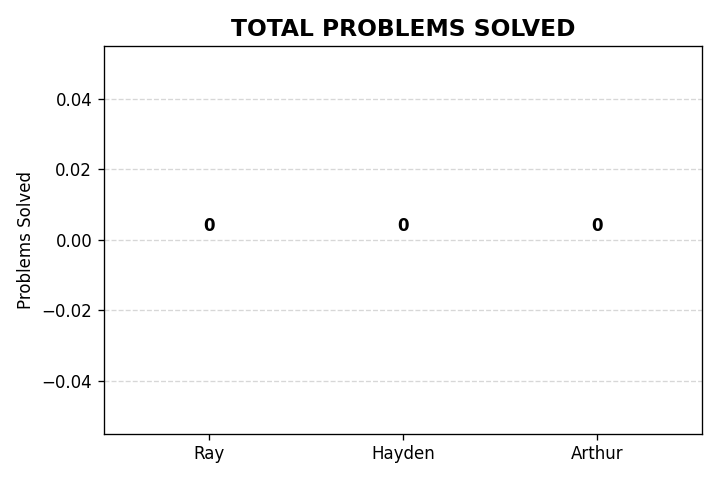
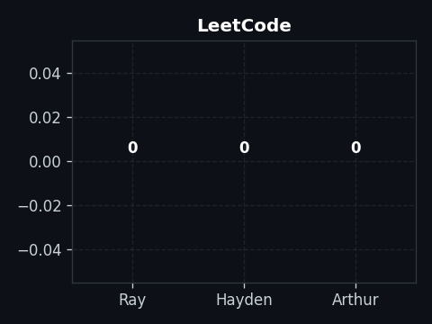
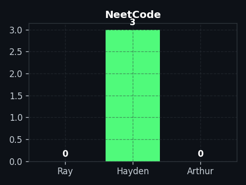
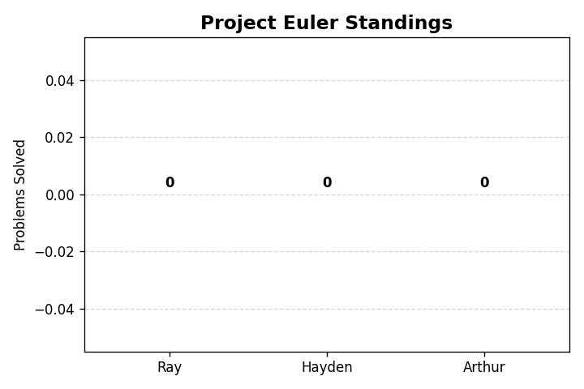

# Daily Coding Tracker

Tracking progress for Hayden, Arthur and Ray.

## Current Standings (Total)
Who is putting in the most work overall?

---

## Category Breakdowns

| LeetCode | NeetCode |
| :---: | :---: |
|  |  |

### Project Euler

## How to Submit fat 
1. Navigate to your folder (eg `Hayden/leetcode`).
2. Add your solution file (must end in `.py`, `.cpp`, `.js`, etc)
3. Push to main
4. Wait 60 seconds for graphs to update
5. yay!!!