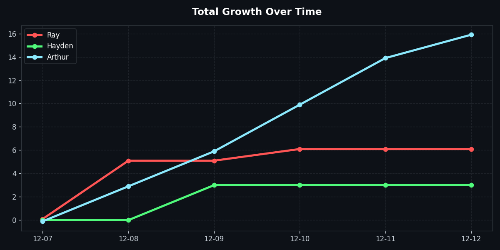
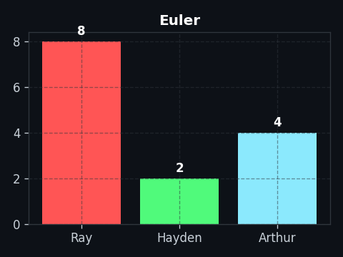

<h1 align="center">daily tracker</h1>

  <strong><a href="./Ray">Ray</a></strong> (Red) vs <strong><a href="./Hayden">Hayden</a></strong> (Green) vs <strong><a href="./Arthur">Arthur</a></strong> (Blue)

---

<!-- DAILY_CHALLENGE_START -->
### Daily Challenge - Day 42 (Started Dec 8, 2025)

| 🟢 Easy | 🟡 Medium | 🔴 Hard | 📐 Project Euler (2/day) | 🚀 NeetCode |
| :---: | :---: | :---: | :---: | :---: |
| [Slowest Key](https://leetcode.com/problems/slowest-key/) | [Remove Nth Node From End of List](https://leetcode.com/problems/remove-nth-node-from-end-of-list/) | [Permutation Sequence](https://leetcode.com/problems/permutation-sequence/) | [Path Sum: Four Ways](https://projecteuler.net/problem=83) [Monopoly Odds](https://projecteuler.net/problem=84) | [NeetCode Practice](https://neetcode.io/practice) |
<!-- DAILY_CHALLENGE_END -->

---

<h2 align="center">total growth over time</h2>

  

  <em>note: a 0.1 jitter is added to scores so lines don't overlap if we are tied</em>

---

<h2 align="center">📊 Category Breakdown</h2>

| **LeetCode** | **NeetCode** | **Project Euler** |
| :---: | :---: | :---: |
|  |  |  |

 

## how to submit
1. go to your folder (eg. `ray/leetcode`)
2. add your solution file (`.py`, `.js`, `.cpp` etc)
3. **Push to main.**
4. the bot will update the graphs in ~30 seconds
5. yay!

---

<!-- CHALLENGE_HISTORY_START -->

<b> Click to view previous challenges </b>

| Day | Date | Easy | Medium | Hard | Euler |
|:---:|:---:|:---:|:---:|:---:|:---:|
| **Day 42** | 2026-01-18 | [Slowest Key](https://leetcode.com/problems/slowest-key/) | [Remove Nth Node From End of List](https://leetcode.com/problems/remove-nth-node-from-end-of-list/) | [Permutation Sequence](https://leetcode.com/problems/permutation-sequence/) | [Path Sum: Four Ways](https://projecteuler.net/problem=83) [Monopoly Odds](https://projecteuler.net/problem=84) |
| **Day 41** | 2026-01-17 | [Binary Search](https://leetcode.com/problems/binary-search/) | [Minimum Number of Valid Strings to Form Target I](https://leetcode.com/problems/minimum-number-of-valid-strings-to-form-target-i/) | [Find the Minimum Area to Cover All Ones II](https://leetcode.com/problems/find-the-minimum-area-to-cover-all-ones-ii/) | [Path Sum: Two Ways](https://projecteuler.net/problem=81) [Path Sum: Three Ways](https://projecteuler.net/problem=82) |
| **Day 40** | 2026-01-16 | [Happy Number](https://leetcode.com/problems/happy-number/) | [Implement Magic Dictionary](https://leetcode.com/problems/implement-magic-dictionary/) | [Make Array Empty](https://leetcode.com/problems/make-array-empty/) | [Passcode Derivation](https://projecteuler.net/problem=79) [Square Root Digital Expansion](https://projecteuler.net/problem=80) |
| **Day 39** | 2026-01-15 | [Remove Outermost Parentheses](https://leetcode.com/problems/remove-outermost-parentheses/) | [Find The First Player to win K Games in a Row](https://leetcode.com/problems/find-the-first-player-to-win-k-games-in-a-row/) | [Shortest Subarray with Sum at Least K](https://leetcode.com/problems/shortest-subarray-with-sum-at-least-k/) | [Prime Summations](https://projecteuler.net/problem=77) [Coin Partitions](https://projecteuler.net/problem=78) |
| **Day 38** | 2026-01-14 | [Check If String Is a Prefix of Array](https://leetcode.com/problems/check-if-string-is-a-prefix-of-array/) | [Most Profitable Path in a Tree](https://leetcode.com/problems/most-profitable-path-in-a-tree/) | [Minimum Cost to Make at Least One Valid Path in a Grid](https://leetcode.com/problems/minimum-cost-to-make-at-least-one-valid-path-in-a-grid/) | [Singular Integer Right Triangles](https://projecteuler.net/problem=75) [Counting Summations](https://projecteuler.net/problem=76) |
| **Day 37** | 2026-01-13 | [Find Mode in Binary Search Tree](https://leetcode.com/problems/find-mode-in-binary-search-tree/) | [Alert Using Same Key-Card Three or More Times in a One Hour Period](https://leetcode.com/problems/alert-using-same-key-card-three-or-more-times-in-a-one-hour-period/) | [Shortest Impossible Sequence of Rolls](https://leetcode.com/problems/shortest-impossible-sequence-of-rolls/) | [Counting Fractions in a Range](https://projecteuler.net/problem=73) [Digit Factorial Chains](https://projecteuler.net/problem=74) |
| **Day 36** | 2026-01-12 | [Reverse Only Letters](https://leetcode.com/problems/reverse-only-letters/) | [Minimum Cost to Make Arrays Identical](https://leetcode.com/problems/minimum-cost-to-make-arrays-identical/) | [Total Characters in String After Transformations II](https://leetcode.com/problems/total-characters-in-string-after-transformations-ii/) | [Ordered Fractions](https://projecteuler.net/problem=71) [Counting Fractions](https://projecteuler.net/problem=72) |
| **Day 35** | 2026-01-11 | [Find Products with Valid Serial Numbers](https://leetcode.com/problems/find-products-with-valid-serial-numbers/) | [Count Zero Request Servers](https://leetcode.com/problems/count-zero-request-servers/) | [Basic Calculator IV](https://leetcode.com/problems/basic-calculator-iv/) | [Totient Maximum](https://projecteuler.net/problem=69) [Totient Permutation](https://projecteuler.net/problem=70) |
| **Day 34** | 2026-01-10 | [Count Negative Numbers in a Sorted Matrix](https://leetcode.com/problems/count-negative-numbers-in-a-sorted-matrix/) | [Stone Game VII](https://leetcode.com/problems/stone-game-vii/) | [Maximum Profit from Valid Topological Order in DAG](https://leetcode.com/problems/maximum-profit-from-valid-topological-order-in-dag/) | [Maximum Path Sum II](https://projecteuler.net/problem=67) [Magic 5-gon Ring](https://projecteuler.net/problem=68) |
| **Day 33** | 2026-01-09 | [Sort Array By Parity II](https://leetcode.com/problems/sort-array-by-parity-ii/) | [Maximize Score of Numbers in Ranges](https://leetcode.com/problems/maximize-score-of-numbers-in-ranges/) | [Dice Roll Simulation](https://leetcode.com/problems/dice-roll-simulation/) | [Convergents of $e$](https://projecteuler.net/problem=65) [Diophantine Equation](https://projecteuler.net/problem=66) |
| **Day 32** | 2026-01-08 | [Find Target Indices After Sorting Array](https://leetcode.com/problems/find-target-indices-after-sorting-array/) | [Minimum Number of Coins to be Added](https://leetcode.com/problems/minimum-number-of-coins-to-be-added/) | [Maximize the Distance Between Points on a Square](https://leetcode.com/problems/maximize-the-distance-between-points-on-a-square/) | [Powerful Digit Counts](https://projecteuler.net/problem=63) [Odd Period Square Roots](https://projecteuler.net/problem=64) |
| **Day 31** | 2026-01-07 | [Largest Even Number](https://leetcode.com/problems/largest-even-number/) | [Beautiful Towers II](https://leetcode.com/problems/beautiful-towers-ii/) | [Maximum Number of K-Divisible Components](https://leetcode.com/problems/maximum-number-of-k-divisible-components/) | [Cyclical Figurate Numbers](https://projecteuler.net/problem=61) [Cubic Permutations](https://projecteuler.net/problem=62) |
| **Day 30** | 2026-01-06 | [Count Prefix and Suffix Pairs I](https://leetcode.com/problems/count-prefix-and-suffix-pairs-i/) | [Taking Maximum Energy From the Mystic Dungeon](https://leetcode.com/problems/taking-maximum-energy-from-the-mystic-dungeon/) | [Number of Increasing Paths in a Grid](https://leetcode.com/problems/number-of-increasing-paths-in-a-grid/) | [XOR Decryption](https://projecteuler.net/problem=59) [Prime Pair Sets](https://projecteuler.net/problem=60) |
| **Day 29** | 2026-01-05 | [Buddy Strings](https://leetcode.com/problems/buddy-strings/) | [Check if Grid can be Cut into Sections](https://leetcode.com/problems/check-if-grid-can-be-cut-into-sections/) | [Find All People With Secret](https://leetcode.com/problems/find-all-people-with-secret/) | [Square Root Convergents](https://projecteuler.net/problem=57) [Spiral Primes](https://projecteuler.net/problem=58) |
| **Day 28** | 2026-01-04 | [Swap Sex of Employees](https://leetcode.com/problems/swap-sex-of-employees/) | [Count Sorted Vowel Strings](https://leetcode.com/problems/count-sorted-vowel-strings/) | [Zuma Game](https://leetcode.com/problems/zuma-game/) | [Lychrel Numbers](https://projecteuler.net/problem=55) [Powerful Digit Sum](https://projecteuler.net/problem=56) |
| **Day 27** | 2026-01-03 | [Kth Missing Positive Number](https://leetcode.com/problems/kth-missing-positive-number/) | [Maximum Length of Subarray With Positive Product](https://leetcode.com/problems/maximum-length-of-subarray-with-positive-product/) | [Number of Beautiful Integers in the Range](https://leetcode.com/problems/number-of-beautiful-integers-in-the-range/) | [Combinatoric Selections](https://projecteuler.net/problem=53) [Poker Hands](https://projecteuler.net/problem=54) |
| **Day 26** | 2026-01-02 | [Goat Latin](https://leetcode.com/problems/goat-latin/) | [Minimum Elements to Add to Form a Given Sum](https://leetcode.com/problems/minimum-elements-to-add-to-form-a-given-sum/) | [Longest Subsequence Repeated k Times](https://leetcode.com/problems/longest-subsequence-repeated-k-times/) | [Prime Digit Replacements](https://projecteuler.net/problem=51) [Permuted Multiples](https://projecteuler.net/problem=52) |
| **Day 25** | 2026-01-01 | [Latest Time by Replacing Hidden Digits](https://leetcode.com/problems/latest-time-by-replacing-hidden-digits/) | [Non-decreasing Array](https://leetcode.com/problems/non-decreasing-array/) | [Length of the Longest Increasing Path](https://leetcode.com/problems/length-of-the-longest-increasing-path/) | [Problem 49](https://projecteuler.net/problem=49) [Problem 50](https://projecteuler.net/problem=50) |
| **Day 24** | 2025-12-31 | [Decode XORed Array](https://leetcode.com/problems/decode-xored-array/) | [Apply Operations to Make Sum of Array Greater Than or Equal to k](https://leetcode.com/problems/apply-operations-to-make-sum-of-array-greater-than-or-equal-to-k/) | [Cat and Mouse II](https://leetcode.com/problems/cat-and-mouse-ii/) | [Distinct Primes Factors](https://projecteuler.net/problem=47) [Self Powers](https://projecteuler.net/problem=48) |
| **Day 23** | 2025-12-30 | [Arranging Coins](https://leetcode.com/problems/arranging-coins/) | [Minimum Deletion Cost to Make All Characters Equal](https://leetcode.com/problems/minimum-deletion-cost-to-make-all-characters-equal/) | [Distinct Subsequences](https://leetcode.com/problems/distinct-subsequences/) | [Triangular, Pentagonal, and Hexagonal](https://projecteuler.net/problem=45) [Goldbach's Other Conjecture](https://projecteuler.net/problem=46) |
| **Day 22** | 2025-12-29 | [Maximum Sum With Exactly K Elements ](https://leetcode.com/problems/maximum-sum-with-exactly-k-elements/) | [Difference Between Ones and Zeros in Row and Column](https://leetcode.com/problems/difference-between-ones-and-zeros-in-row-and-column/) | [Number of Flowers in Full Bloom](https://leetcode.com/problems/number-of-flowers-in-full-bloom/) | [Problem 43](https://projecteuler.net/problem=43) [Problem 44](https://projecteuler.net/problem=44) |
| **Day 21** | 2025-12-28 | [Intersection of Two Arrays](https://leetcode.com/problems/intersection-of-two-arrays/) | [Maximum Absolute Sum of Any Subarray](https://leetcode.com/problems/maximum-absolute-sum-of-any-subarray/) | [Count K-Reducible Numbers Less Than N](https://leetcode.com/problems/count-k-reducible-numbers-less-than-n/) | [Pandigital Prime](https://projecteuler.net/problem=41) [Coded Triangle Numbers](https://projecteuler.net/problem=42) |
| **Day 20** | 2025-12-27 | [Two Sum IV - Input is a BST](https://leetcode.com/problems/two-sum-iv-input-is-a-bst/) | [Minimum Number of Operations to Have Distinct Elements](https://leetcode.com/problems/minimum-number-of-operations-to-have-distinct-elements/) | [Max Value of Equation](https://leetcode.com/problems/max-value-of-equation/) | [Integer Right Triangles](https://projecteuler.net/problem=39) [Champernowne's Constant](https://projecteuler.net/problem=40) |
| **Day 19** | 2025-12-26 | [Check if The Number is Fascinating](https://leetcode.com/problems/check-if-the-number-is-fascinating/) | [Matchsticks to Square](https://leetcode.com/problems/matchsticks-to-square/) | [Shortest Matching Substring](https://leetcode.com/problems/shortest-matching-substring/) | [Truncatable Primes](https://projecteuler.net/problem=37) [Pandigital Multiples](https://projecteuler.net/problem=38) |
| **Day 18** | 2025-12-25 | [Binary Prefix Divisible By 5](https://leetcode.com/problems/binary-prefix-divisible-by-5/) | [Maximum Ice Cream Bars](https://leetcode.com/problems/maximum-ice-cream-bars/) | [Count the Number of Houses at a Certain Distance II](https://leetcode.com/problems/count-the-number-of-houses-at-a-certain-distance-ii/) | [Circular Primes](https://projecteuler.net/problem=35) [Double-base Palindromes](https://projecteuler.net/problem=36) |
| **Day 17** | 2025-12-24 | [Rename Columns](https://leetcode.com/problems/rename-columns/) | [Rotting Oranges](https://leetcode.com/problems/rotting-oranges/) | [Find the Occurrence of First Almost Equal Substring](https://leetcode.com/problems/find-the-occurrence-of-first-almost-equal-substring/) | [Digit Cancelling Fractions](https://projecteuler.net/problem=33) [Digit Factorials](https://projecteuler.net/problem=34) |
| **Day 16** | 2025-12-23 | [Word Pattern](https://leetcode.com/problems/word-pattern/) | [Construct the Longest New String](https://leetcode.com/problems/construct-the-longest-new-string/) | [Longest Happy Prefix](https://leetcode.com/problems/longest-happy-prefix/) | [Coin Sums](https://projecteuler.net/problem=31) [Pandigital Products](https://projecteuler.net/problem=32) |
| **Day 15** | 2025-12-22 | [Longer Contiguous Segments of Ones than Zeros](https://leetcode.com/problems/longer-contiguous-segments-of-ones-than-zeros/) | [Lexicographically Smallest Equivalent String](https://leetcode.com/problems/lexicographically-smallest-equivalent-string/) | [Count of Integers](https://leetcode.com/problems/count-of-integers/) | [Distinct Powers](https://projecteuler.net/problem=29) [Digit Fifth Powers](https://projecteuler.net/problem=30) |
| **Day 14** | 2025-12-21 | [Leaf-Similar Trees](https://leetcode.com/problems/leaf-similar-trees/) | [Count and Say](https://leetcode.com/problems/count-and-say/) | [Count Subarrays With Score Less Than K](https://leetcode.com/problems/count-subarrays-with-score-less-than-k/) | [Quadratic Primes](https://projecteuler.net/problem=27) [Number Spiral Diagonals](https://projecteuler.net/problem=28) |
| **Day 13** | 2025-12-20 | [Maximum 69 Number](https://leetcode.com/problems/maximum-69-number/) | [Find Unique Binary String](https://leetcode.com/problems/find-unique-binary-string/) | [Find the Number of Ways to Place People II](https://leetcode.com/problems/find-the-number-of-ways-to-place-people-ii/) | [$1000$-digit Fibonacci Number](https://projecteuler.net/problem=25) [Reciprocal Cycles](https://projecteuler.net/problem=26) |
| **Day 12** | 2025-12-19 | [Check if Number Has Equal Digit Count and Digit Value](https://leetcode.com/problems/check-if-number-has-equal-digit-count-and-digit-value/) | [House Robber III](https://leetcode.com/problems/house-robber-iii/) | [Count Connected Components in LCM Graph](https://leetcode.com/problems/count-connected-components-in-lcm-graph/) | [Non-Abundant Sums](https://projecteuler.net/problem=23) [Lexicographic Permutations](https://projecteuler.net/problem=24) |
| **Day 11** | 2025-12-18 | [Count Distinct Numbers on Board](https://leetcode.com/problems/count-distinct-numbers-on-board/) | [Find the Largest Area of Square Inside Two Rectangles](https://leetcode.com/problems/find-the-largest-area-of-square-inside-two-rectangles/) | [Minimum Number of Valid Strings to Form Target II](https://leetcode.com/problems/minimum-number-of-valid-strings-to-form-target-ii/) | [Amicable Numbers](https://projecteuler.net/problem=21) [Names Scores](https://projecteuler.net/problem=22) |
| **Day 10** | 2025-12-17 | [Project Employees I](https://leetcode.com/problems/project-employees-i/) | [Longest Mountain in Array](https://leetcode.com/problems/longest-mountain-in-array/) | [Partition Array for Maximum XOR and AND](https://leetcode.com/problems/partition-array-for-maximum-xor-and-and/) | [Counting Sundays](https://projecteuler.net/problem=19) [Factorial Digit Sum](https://projecteuler.net/problem=20) |
| **Day 9** | 2025-12-16 | [Minimum Operations to Collect Elements](https://leetcode.com/problems/minimum-operations-to-collect-elements/) | [Employee Importance](https://leetcode.com/problems/employee-importance/) | [Minimize Deviation in Array](https://leetcode.com/problems/minimize-deviation-in-array/) | [Number Letter Counts](https://projecteuler.net/problem=17) [Maximum Path Sum I](https://projecteuler.net/problem=18) |
| **Day 8** | 2025-12-15 | [Number of Bit Changes to Make Two Integers Equal](https://leetcode.com/problems/number-of-bit-changes-to-make-two-integers-equal/) | [Digit Operations to Make Two Integers Equal](https://leetcode.com/problems/digit-operations-to-make-two-integers-equal/) | [Merge Operations for Minimum Travel Time](https://leetcode.com/problems/merge-operations-for-minimum-travel-time/) | [Lattice Paths](https://projecteuler.net/problem=15) [Power Digit Sum](https://projecteuler.net/problem=16) |
| **Day 7** | 2025-12-14 | [Consecutive Characters](https://leetcode.com/problems/consecutive-characters/) | [Insert Interval](https://leetcode.com/problems/insert-interval/) | [Count Distinct Subarrays Divisible by K in Sorted Array](https://leetcode.com/problems/count-distinct-subarrays-divisible-by-k-in-sorted-array/) | [Large Sum](https://projecteuler.net/problem=13) [Longest Collatz Sequence](https://projecteuler.net/problem=14) |

<!-- CHALLENGE_HISTORY_END -->
---
